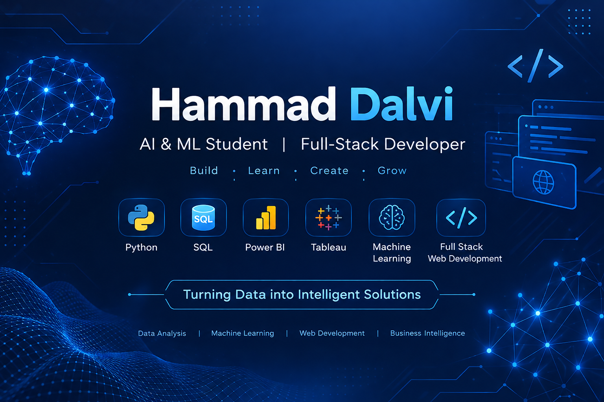

 

<h1 align="center">Hi 👋, I'm Hammad Dalvi</h1>

---

## 💫 About Me

🎓 B.Tech Artificial Intelligence & Machine Learning Student

I'm passionate about building real-world applications using **Artificial Intelligence, Machine Learning, and Full-Stack Development**.

I enjoy turning ideas into practical solutions, exploring new technologies, and continuously improving my problem-solving skills.

My interests include:

- 🤖 Artificial Intelligence & Machine Learning
- 💻 Full-Stack Web Development
- 🧠 Data Science & Intelligent Applications
- 🚀 Building and deploying real-world projects
- 🤝 Open Source & Collaboration

Currently exploring **AI-powered applications, Machine Learning, and modern web technologies** through hands-on projects.

📬 Open to collaboration, learning opportunities, and exciting tech projects.

---

## 🧠 Currently Learning & Exploring

- Machine Learning & AI Model Development
- Full-Stack Web Development
- Backend Development with Node.js
- Building AI-powered applications
- Data Analysis & Visualization
- Cloud Deployment & Application Development

---

## 🚀 Featured Projects

### 🌐 Personal Portfolio

My personal developer portfolio showcasing my **skills, projects, experience, and work in AI/ML and Full-Stack Development**.

- 💻 Personal portfolio website
- 🎨 Modern and professional UI
- 📱 Responsive design
- 🚀 Built to showcase my projects and technical skills

🔗 **[View Portfolio Repository](https://github.com/CodewithHammad08/Personal_Portfolio)**

---

### ❤️ Heart Disease Prediction

A Machine Learning project focused on predicting the likelihood of heart disease using patient health-related data.

- 🧠 Machine Learning model development
- 📊 Data preprocessing and analysis
- 🔍 Predictive analytics
- 🩺 AI-powered health risk prediction

🔗 **[Explore My Repositories](https://github.com/CodewithHammad08?tab=repositories)**

---

## 🌐 Connect With Me

---

# 💻 Tech Stack:

---

## 📊 GitHub Analytics

---

## 🔥 GitHub Contributions

---

⭐ Thanks for visiting my profile!

**Let's build something amazing together. 🚀**

